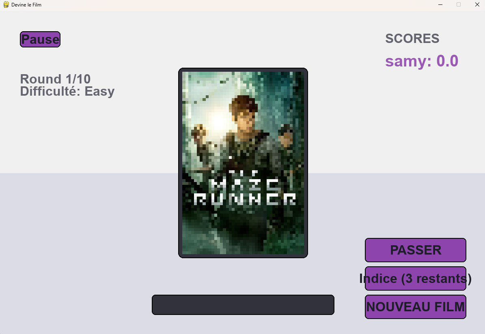

# 🎬 Guess the Movie

A fun and interactive movie guessing game built with Python and Pygame. Test your movie knowledge as you try to identify movies from progressively clearer poster images!



## 🎮 Features

- **Multiple Players**: Play with up to 3 players
- **Difficulty Levels**: Choose between Easy, Medium, and Hard modes
- **Movie Filters**: Customize your game with filters for year, genre, director, and rating
- **Visual Themes**: Choose between Dark, Light, and Retro themes
- **Hints System**: Get up to 3 hints per movie
- **Score Tracking**: Keep track of player scores and streaks
- **Sound Effects**: Immersive sound effects for correct/incorrect guesses
- **Pause Menu**: Pause the game and change settings anytime

## 🛠️ Requirements

- Python 3.x
- Pygame
- Requests library
- NumPy

## 📦 Installation

1. Clone the repository:
```bash
git clone https://github.com/yourusername/guess_the_movie.git
cd guess_the_movie
```

2. Install the required dependencies:
```bash
pip install -r requirements.txt
```

## 🚀 How to Play

1. Run the game:
```bash
python gtm_api.py
```

2. Select the number of players (1-3)
3. Enter player names and their assigned keys
4. Choose your difficulty level
5. Optionally set movie filters
6. Select your preferred theme
7. Start guessing movies!

### Game Rules:
- Each player takes turns guessing the movie
- The image starts pixelated and gradually becomes clearer
- Use hints wisely (you get 3 per movie)
- Score points based on:
  - Difficulty level
  - Time taken to guess
  - Number of hints used
  - Current streak

## 🎯 Controls

- Use your assigned key to start guessing
- Type your guess and press Enter
- Press ESC to pause the game
- Use the "HINT" button to get clues
- Use the "SKIP" button to pass

## 🎨 Themes

- **Dark Mode**: Modern dark theme with vibrant accents
- **Light Mode**: Clean and bright interface
- **Retro Mode**: Classic arcade-style theme

## 📝 License

This project is licensed under my very own saying.

## 📧 Contact

For any questions or suggestions, please open an issue in the repository.

---

Made with ❤️ by Samy
